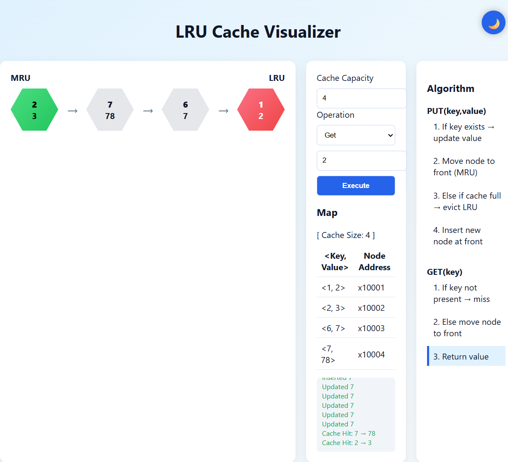

# 🧠 LRU Cache Visualizer

## 🚀 Overview

This project is an interactive **LRU (Least Recently Used) Cache Visualizer** built using **HTML, CSS, and JavaScript**.

It demonstrates how an LRU cache works internally using:

* **HashMap (O(1) access)**
* **Doubly Linked List (ordering elements)**

---

## 📸 Demo



---

## ⚡ Features

* 📌 Real-time visualization of cache state
* ⚡ O(1) `get()` and `put()` operations
* 🔄 Automatic eviction of least recently used items
* 📊 Displays cache hits and misses
* 🎯 Interactive UI

---

## 🛠️ Tech Stack

* HTML
* CSS
* JavaScript

---

## 🧩 How It Works

* Recently accessed items move to **MRU (front)**
* Least used items stay at **LRU (end)**
* When capacity exceeds → **LRU gets removed**

---

## 📁 Project Structure

```
LRU-Cache/
│── index.html
│── screenshot.png
```

---

## ▶️ How to Run

1. Clone the repository
2. Open `index.html` in your browser

---

## 💡 Learning Outcomes

* LRU Cache design understanding
* Data structures (HashMap + DLL)
* DOM manipulation & visualization

---

## 🔗 Author

**Sowmya Kanaparthi**

---

## ⭐ Support

If you like this project, give it a star ⭐
